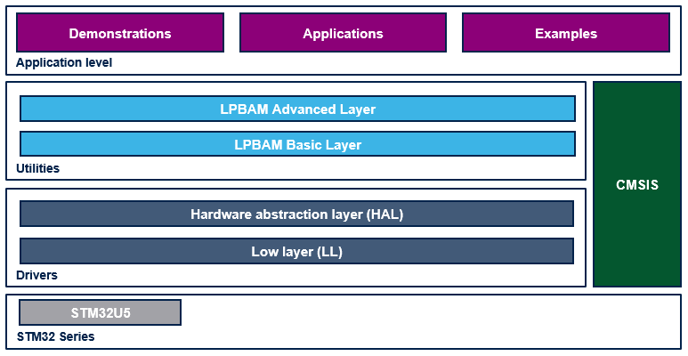

::: {.row}
::: {.col-sm-12 .col-lg-4}

# Release Notes for <mark>STM32Cube LPBAM Utility Drivers</mark>
Copyright &copy; 2021 STMicroelectronics\

{.logo}

# Purpose

This directory contains STM32Cube **LPBAM** Utilities drivers.

**LPBAM** : **L**ow **P**ower **B**ackground **A**utonomous **M**ode

- The LPBAM utility is a helper software that permits to program simply the STM32 autonomous peripherals to operate
  independently from low power modes and without any software running thanks to DMA linked-list feature

- LPBAM utility provides two user layers
    - LPBAM Basic Layer
        - Full use cases support
		- I/O at DMA node level
		- Abstracts node creation complexity

	- LPBAM Advanced Layer
	    - Typical use cases support
		- I/O at DMA queue of nodes level
		- Abstracts queue creation complexity

- LPBAM utility is a hardware agnostic software ensuring full portability across STM32 portfolio

:::

::: {.col-sm-12 .col-lg-8}
# Update History

::: {.collapse}
<input type="checkbox" id="collapse-section2" checked aria-hidden="true">
<label for="collapse-section2" aria-hidden="true">V1.0.1 / 24-Sept-2021</label>

			
## Main Changes

### Component release
**Fixed bugs list**

  Headline
  --------
  I2C : Fix stop condition generation for not sequential transfers.

**Module changes**

-	DAC
    - Rename LPBAM_DAC_TRIGGER_LPTIM1_OUT to LPBAM_DAC_TRIGGER_LPTIM1_CH1.
    - Rename LPBAM_DAC_TRIGGER_LPTIM3_OUT to LPBAM_DAC_TRIGGER_LPTIM3_CH1.

-	LPTIM
    - Replace all compare match occurrence by update event in the documentation.
    - Replace all CM with UE suffix in APIs, types and defines.

-	SPI
    - Replace all Transmit wording by Tx in all APIs.
    - Replace all Receive wording by Rx in all APIs.

-	I2C
    - Replace all Transmit wording by Tx in all APIs.
    - Replace all Receive wording by Rx in all APIs.

## Known Limitations

-	None

## Backward Compatibility

-	This version breaks the compatibility with previous versions for DAC, LPTIM, I2C and SPI modules.

:::

::: {.collapse}
<input type="checkbox" id="collapse-section1" aria-hidden="true">
<label for="collapse-section1" aria-hidden="true">V1.0.0 / 28-June-2021</label>

			
## Main Changes

### Component release

-	First Official release of LPBAM utility drivers

:::

:::
:::

<footer class="sticky">
For complete documentation on STM32,visit: [[www.st.com/stm32](http://www.st.com)]

This release note uses up to date web standards and, for this reason, should not be opened with Internet Explorer
but preferably with popular browsers such as Google Chrome, Mozilla Firefox, Opera or Microsoft Edge.
</footer>
